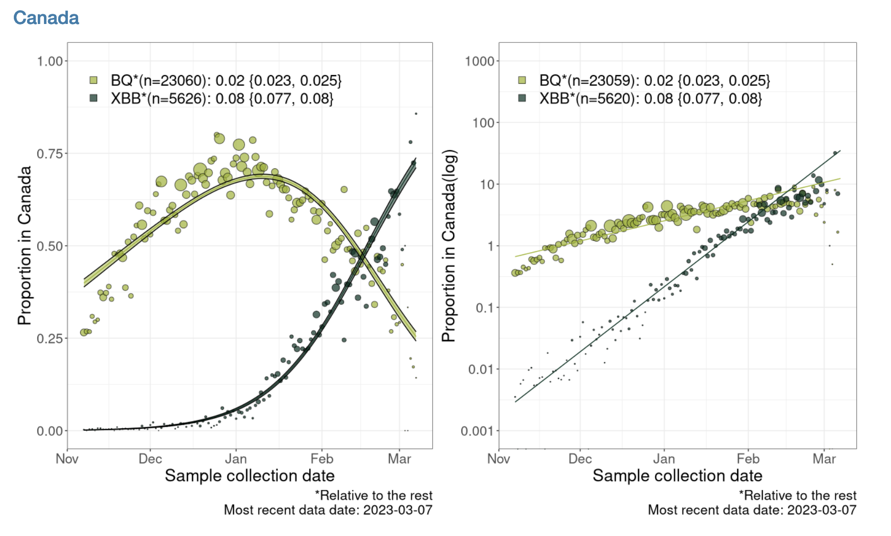

# Mar 24 **ASSIGNMENT** Selection for COVID-19 variants

Class will be in CSF 2238.

Visit the CoVaRRnet's website for [duotang](https://covarr-net.github.io/duotang/duotang.html) 

Below is an analysis that estimates the selection coefficient related to this plot estimating the selection coefficients for the BQ* and XBB* variants relative to each other for all of Canada:

```{r, echo=FALSE, out.width = '90%'}

```

Note that BQ* and XBB* are aggregations of finer variant classifications.

**ASSIGNMENT 4: Your assignment is to write an .Rmd notebook that estimates the selection coefficient for different variants, and/or for a province rather than all of Canada. You need to include a graph, and state your estimate of the selection coefficient. This assignment is due FRIDAY MARCH 31**

The duotong website contains several of the graphs for the other variants and/or regions to give you an idea of how data rich your chosen analysis might be before you start it.

First we load the packages we will need:
```{r, message=F}
library("dplyr")
library("ggplot2")
```

The data can be download from Duotang. You can do this by clicking on _Frequency table download_. However, I have already downloaded the data and uploaded it to a website so it can also be loaded into `R` as follows:

```{r}
data = read.delim("https://raw.githubusercontent.com/ahurford/biol-4605-data/main/data2/Last%20120%20days.tsv", header=TRUE)
```

Note that the file is `.tsv` format, so I needed to look up what `R` function could read that in.

Now that the data is loaded, the challenge in replicating the analysis, is cleaning the data up into the right form so that we can do the linear regression. We use the `tidyr` package commands to clean our data.

```{r, results = F}
data = data%>%rename(percent = X..Frequency)
```

The code above renames a columan to make it a bit easier to work with in subsequent coding.

```{r, results = F}
data$Frequency=as.numeric(data$Frequency)
data$Date = as.Date(data$Date)
data$percent =as.numeric(sub("%", "", data$percent))
```

The above commands are to correctly designate the type of variables in the columns. Generally, dates don't read in as dates, and you need to explicitly state that they are dates using `as.Date()` before `R` will treat them as such. When data is stored with a `%`, then `R` tends initially understand that as a word, and fails to complete problems such as `10% + 10%` until we remove the `%` and tag the resulting quantity as a number.


```{r}
df= data.frame(Date = data$Date, Number = data$Frequency, Lineage = data$Lineage)

g1=ggplot(df, aes(x = Date, y = Number, fill=Lineage)) + 
  geom_bar(stat = "identity")+
  scale_fill_manual(values = rainbow(26))
g1
```

(I even tried to replicate the color palette of the plot, however, that didn't work and the colors are a bit ghastly!)

To replicate the plot I am trying to replicate, I need to aggregate some lineages. (This may not be necessary for your analysis. Additionally, there may be a more elegant way of achieve the same thing. Below, is what worked for me). 

```{r}
data2=data%>%mutate(group=case_when(Lineage == "BQ.1" ~ "BQ*",
                                    Lineage == "BQ.1.1" ~ "BQ*",
                                    Lineage=="BQ.1.1.1" ~ "BQ*",
                                    Lineage=="BQ.1.1.18" ~ "BQ*",
                                    Lineage=="BQ.1.1.3" ~ "BQ*",
                                    Lineage=="BQ.1.1.4" ~ "BQ*",
                                    Lineage=="BQ.1.1.5" ~ "BQ*",
                                    Lineage=="BQ.1.10.1"~ "BQ*",
                                    Lineage=="BQ.1.12"~"BQ*",
                                    Lineage=="BQ.1.13"~ "BQ*",
                                    Lineage=="BQ.1.14"~ "BQ*",
                                    Lineage=="BQ.1.2"~ "BQ*",
                                    Lineage=="BQ.1.25"~ "BQ*",
                                    Lineage=="BQ.1.3"~ "BQ*",
                                    Lineage=="BQ.1.5"~ "BQ*",
                                    Lineage=="XBB.1"~ "XBB*",
                                    Lineage=="XBB.1.5"~ "XBB*",
                              ))
head(data2,10)
```
I need to filter out just the BQ* and XBB* variants, and I need to sum the proportions attributed to each of the lineages aggregated into BQ* or XBB* (such aggregation may not be needed for your analysis). Additionally, I need to calculate the logarithm of the proportion of the variants, and filter out any reports of 0 because the logarithm of 0 is undefined. Also, here, I need to convert from percentage to proportion.

```{r}
data2 = data2%>%group_by(group,Date) %>% 
  summarise(total_prop=sum(percent)/100)%>%filter(group == "XBB*"|group=="BQ*")%>%filter(total_prop>0)
data2 = data2%>%mutate(log_percent = log(total_prop))

g3 =ggplot(data2, aes(x = Date, y = total_prop, group=group)) + 
  geom_point()
g3
```
I want to do the linear regression, but to do this I ended up splitting out the XBB* and QB* variants:
```{r}
XBB = filter(data2, group == "XBB*")
BQ = filter(data2, group == "BQ*")
```

Below, we perform the linear regressions:
```{r}
lm.XBB = lm(log_percent ~ Date,data=XBB)
lm.BQ = lm(log_percent ~ Date,data=BQ)
```

To plot the linear regressions, and the 95% confidence interval, we use the `predict()` function on the linear regression objects, `lm.XBB` and `lm.BQ`.

```{r}
PI.XBB = predict(lm.XBB, se.fit=TRUE, interval="confidence", level=0.95)$fit
PI.BQ = predict(lm.BQ, se.fit=TRUE, interval="confidence", level=0.95)$fit
```

Below, I organize the data, and the linear regression outputs into a data frame to make a plot:
```{r}
XBB.fit = data.frame(Date = XBB$Date, fit = PI.XBB[,1], lwr = PI.XBB[,2], uppr = PI.XBB[,3])
BQ.fit = data.frame(Date = BQ$Date, fit = PI.BQ[,1], lwr = PI.BQ[,2], uppr = PI.BQ[,3])

g4=ggplot(data=XBB.fit, aes(x=Date))+
  geom_ribbon(aes(ymin=lwr, ymax=uppr), alpha = 0.1)+
  geom_line(aes(y=fit))+
  geom_point(aes(y=log_percent), data=BQ)+
geom_ribbon(aes(ymin=lwr, ymax=uppr), alpha = 0.1, data=BQ.fit)+
  geom_line(aes(y=fit), data = BQ.fit)+
  geom_point(aes(y=log_percent), data=XBB)
  g4
```

That is a good plot, but we still need to know the slope of the regression to estimate the selection coefficients for the variants:

```{r}
summary(lm.XBB)
summary(lm.BQ)
```

This tells me the slope of my regression for the XBB* variant is `r round(coef(lm.XBB)[2],3)` and the intercept is `r round(coef(lm.XBB)[1],3)`. For the BQ* variant, the slope is `r round(coef(lm.BQ)[2],3)` and the intercept is `r round(coef(lm.BQ)[1],3)`. You can get these values to print out in your Rmarkdown by writing `round(coef(lm.BQ)[1],3)` (for example) but enclosed within downward dashes, and where the first dash is followed by `r`.

These estimates of the slope are close to the slope of `0.08` for XBB* and `0.02` for BQ* shown in the figure. I expect they are not exact, because the data shown in the figure is more finely resolved on the `Date` axis than the data that could be downloaded.

The selection coefficient is the slope of this regression, see [slide](https://www.zoology.ubc.ca/~otto/Talks/SSE2022_Otto.pdf) 23. The selection coefficient is $s_{XBB*} = r_{XBB*} - r_{all}$, where $r_i$ is the exponential growth rate of the $i$ variant.
